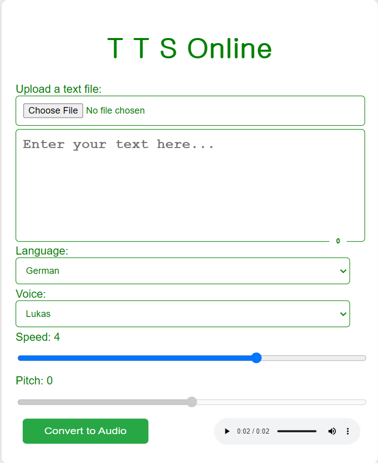

# A basic Online Text to Speech converting tool is created using html, css, javascript, and Voice RSS (III rd party API). The index.html file is the main file, and speak.html is a prototype, or blueprint based on primary experimental demonstrative.
# Visit at: https://onlinefreetts.netlify.app
# Apperance of index.html: Can be depicted via figure in details -

